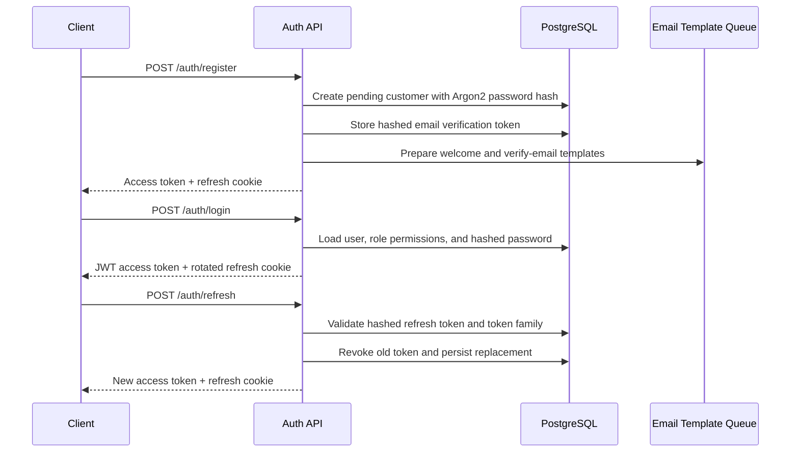
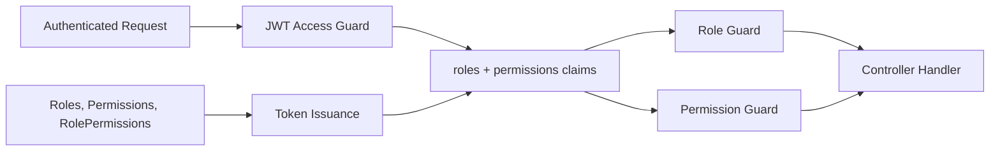

# API Documentation

Swagger is mounted at:

```text
GET /api/docs
```

All API routes use the prefix:

```text
/api/v1
```

## Authentication and User Management

```text
POST /api/v1/auth/register
POST /api/v1/auth/login
POST /api/v1/auth/logout
POST /api/v1/auth/refresh
POST /api/v1/auth/forgot-password
POST /api/v1/auth/reset-password
POST /api/v1/auth/change-password
POST /api/v1/auth/verify-email
GET  /api/v1/auth/me

GET    /api/v1/users/me
GET    /api/v1/users
POST   /api/v1/users
GET    /api/v1/users/:id
PATCH  /api/v1/users/profile
PATCH  /api/v1/users/:id
DELETE /api/v1/users/:id

GET   /api/v1/profile
PATCH /api/v1/profile

GET /api/v1/roles
GET /api/v1/roles/:code
POST /api/v1/roles
PATCH /api/v1/roles/:code
PUT /api/v1/roles/:code/permissions
POST /api/v1/roles/:code/permissions
POST /api/v1/roles/:code/permissions/remove

GET /api/v1/permissions

GET /api/v1/activity
```

Public endpoints are marked with the `@Public()` decorator. Protected endpoints require a bearer access token. Permission-gated endpoints use DB-backed permission codes such as `users.view`, `users.edit`, `users.delete`, `roles.view`, `permissions.view`, `profile.update`, and `activity.view`.

Refresh tokens are returned in the response for API clients and also written to the `vn_refresh_token` secure/httpOnly cookie. Refresh and logout accept either the body token or the cookie value.

## Auth Flow



## RBAC Flow



Seeded roles are `CUSTOMER`, `TRAVEL_AGENT`, and `ADMIN`. Milestone 8 adds dynamic role creation, role metadata edits, full permission replacement, incremental permission assignment, and permission removal through `roles.manage`.

## Module Health and Capability Routes

Every non-auth bounded context exposes:

```text
GET /api/v1/{module}/health
GET /api/v1/{module}/capabilities
```

`health` is public for deployment checks. `capabilities` requires the `ADMIN` role.

Production health probes:

```text
GET /api/v1/health
GET /api/v1/health/live
GET /api/v1/health/ready
GET /api/v1/maintenance
PATCH /api/v1/maintenance
GET /api/v1/metrics/prometheus
```

Health/capability modules:

```text
customer
agent
admin
booking
reservation
passenger
search
ticket
booking-history
timeline
seat
tracking
notification
analytics
cms
offers
coupons
supplier
integration
payment
ai
settings
reports
audit
```

## Milestone 10 Integration Routes

```text
GET   /api/v1/integrations/health
GET   /api/v1/integrations/dashboard
GET   /api/v1/integrations/suppliers
PATCH /api/v1/integrations/suppliers/:code
GET   /api/v1/integrations/supplier-priority
POST  /api/v1/integrations/suppliers/:code/test-connection
GET   /api/v1/integrations/logs
GET   /api/v1/integrations/configuration

GET  /api/v1/payments/providers
GET  /api/v1/payments/transactions
POST /api/v1/payments/intents
POST /api/v1/payments/intents/:paymentIntentId/capture
POST /api/v1/payments/webhooks/:provider
```

Integration routes never expose supplier credentials or payment secrets. Live supplier and gateway adapters return not-configured responses until real secret references are configured.

Milestone 8 operational modules for feature flags, platform settings, supplier configuration, and monitoring expose the direct admin routes listed below.

Supplier also exposes:

```text
GET /api/v1/supplier/adapters
```

## Enterprise Admin API

Milestone 8 admin APIs are protected by `ADMIN` roles or management permissions. They are mock-backed unless they intentionally reuse existing booking, ticket, notification, email, activity, or RBAC services. No supplier APIs, payment gateways, SMTP providers, analytics warehouses, monitoring vendors, or storage providers are integrated.

```text
GET  /api/v1/admin/dashboard
GET  /api/v1/admin/bookings
GET  /api/v1/admin/bookings/:bookingId
POST /api/v1/admin/bookings/:bookingId/resend-email

GET   /api/v1/admin/email-templates
PATCH /api/v1/admin/email-templates/:key
POST  /api/v1/admin/email-templates/:key/preview

GET  /api/v1/cms/pages
POST /api/v1/cms/pages
PATCH /api/v1/cms/pages/:pageId
POST /api/v1/cms/pages/:pageId/publish

GET  /api/v1/coupons
POST /api/v1/coupons
PATCH /api/v1/coupons/:couponId
POST /api/v1/coupons/:couponId/toggle

GET  /api/v1/offers
POST /api/v1/offers
PATCH /api/v1/offers/:offerId
POST /api/v1/offers/:offerId/toggle

GET  /api/v1/admin/notifications
POST /api/v1/admin/notifications/send

GET  /api/v1/reports/admin
POST /api/v1/reports/admin

GET  /api/v1/analytics/dashboard
GET  /api/v1/audit/logs
GET  /api/v1/activity

GET   /api/v1/feature-flags
PATCH /api/v1/feature-flags/:flagId

GET   /api/v1/platform-settings
PATCH /api/v1/platform-settings/:settingId

GET   /api/v1/supplier-configurations
PATCH /api/v1/supplier-configurations/:supplierId

GET  /api/v1/monitoring
```

Admin booking filters:

```text
search
status
operator
source
destination
journeyDate
sortBy
sortDirection
page
pageSize
```

Admin report generation request:

```json
{
  "name": "Monthly Revenue",
  "type": "REVENUE",
  "period": "MONTHLY",
  "format": "CSV"
}
```

Feature flag update request:

```json
{
  "enabled": true,
  "rolloutPercentage": 75,
  "description": "Enable coupon stacking for admin validation."
}
```

Supplier configuration records are placeholders only. They store enablement, priority, environment, owner, health, and credential-reference metadata without creating any BCI, RedBus, AbhiBus, TBO, or Custom API client.

## Milestone 9 Performance And Operations API

Milestone 9 APIs are mock-backed and architecture-first. Redis and BullMQ are modeled as first-class platform boundaries, but no supplier, payment, SMTP, SMS, WhatsApp, push, OpenAI/LLM, monitoring vendor, or storage provider is integrated.

Public health endpoints intentionally sit outside the versioned prefix:

```text
GET /api/health
GET /api/ready
GET /api/live
```

Versioned operational APIs:

```text
GET  /api/v1/ai/recommendations
POST /api/v1/ai/recommendations/recently-viewed

GET    /api/v1/notifications
GET    /api/v1/notifications/center
POST   /api/v1/notifications/:id/read
POST   /api/v1/notifications/mark-all-read
POST   /api/v1/notifications/:id/archive
DELETE /api/v1/notifications/:id

GET  /api/v1/cache
POST /api/v1/cache/warm

GET  /api/v1/queues
POST /api/v1/queues/enqueue

GET  /api/v1/scheduler/jobs
POST /api/v1/scheduler/jobs/:jobId/run

GET /api/v1/metrics
GET /api/v1/monitoring

GET  /api/v1/search/suggestions
POST /api/v1/search/recent
GET  /api/v1/search/insights

GET /api/v1/seo/metadata
GET /api/v1/seo/sitemap
```

AI recommendation response includes `engine: "MOCK_RULES"` and an explicit architecture block showing `modelProvider: "NONE"` and the future provider port. Cache responses identify `provider: "REDIS"`. Queue responses identify `driver: "BULLMQ"` and include retry/dead-letter state.

## Search API

The Milestone 4 bus search API is public and backed by the local mock supplier adapter. It does not call BCI, RedBus, AbhiBus, TBO, or any other third-party inventory API.

```text
POST /api/v1/search
GET  /api/v1/search/mock-dataset
```

Example request:

```json
{
  "sourceCity": "Bangalore",
  "destinationCity": "Hyderabad",
  "journeyDate": "2026-09-10",
  "passengerCount": 1,
  "busTypes": ["AC Sleeper"],
  "amenities": ["WiFi", "Charging Point"],
  "minPrice": 700,
  "maxPrice": 2500,
  "minRating": 4,
  "liveTracking": true,
  "sortBy": "PRICE_ASC",
  "page": 1,
  "pageSize": 12
}
```

Response shape:

```json
{
  "success": true,
  "totalResults": 24,
  "buses": [],
  "filters": {
    "price": { "min": 599, "max": 3199 },
    "departureWindows": [],
    "arrivalWindows": [],
    "busTypes": [],
    "operators": [],
    "amenities": [],
    "availableSeats": { "min": 0, "max": 48 },
    "ratings": []
  },
  "pagination": {
    "page": 1,
    "pageSize": 12,
    "totalPages": 2,
    "hasNextPage": true,
    "hasPreviousPage": false
  }
}
```

Supported sort values are `PRICE_ASC`, `PRICE_DESC`, `DEPARTURE_ASC`, `ARRIVAL_ASC`, `FASTEST`, `DURATION_ASC`, `RATING_DESC`, and `POPULARITY_DESC`.

## Seat, Booking, Ticket, And History API

The Milestone 6 booking and ticket API is public and backed by `MockSupplierAdapter` plus internal mock ticket/email/notification services. It does not call BCI, RedBus, AbhiBus, TBO, payment gateways, external email providers, live tracking providers, or S3.

```text
GET  /api/v1/seats/:tripId?date=2026-09-10
POST /api/v1/seats/hold
POST /api/v1/seats/release
GET  /api/v1/bookings
GET  /api/v1/bookings/history
GET  /api/v1/bookings/upcoming
GET  /api/v1/bookings/past
GET  /api/v1/bookings/cancelled
GET  /api/v1/bookings/:id
POST /api/v1/bookings/create
POST /api/v1/bookings/confirm
POST /api/v1/bookings/cancel
POST /api/v1/bookings/reschedule
GET  /api/v1/bookings/:bookingId/timeline
GET  /api/v1/tickets/:id
GET  /api/v1/tickets/:id/pdf
GET  /api/v1/tickets/:id/download
POST /api/v1/tickets/email
GET  /api/v1/notifications
POST /api/v1/notifications/:id/read
```

## B2B Travel Agent API

Milestone 7 agent APIs are mock-backed and reuse the existing search, seat, booking, ticket,
email, notification, and history services. No supplier APIs are integrated.

```text
GET    /api/v1/agent/dashboard

GET    /api/v1/agent/customers
GET    /api/v1/agent/customers/:id
POST   /api/v1/agent/customers
PATCH  /api/v1/agent/customers/:id
DELETE /api/v1/agent/customers/:id

GET    /api/v1/agent/bookings
POST   /api/v1/agent/bookings
POST   /api/v1/agent/bookings/email-ticket

GET    /api/v1/agent/reports
GET    /api/v1/agent/notifications
```

Agent customer create request:

```json
{
  "name": "Aarav Sharma",
  "email": "aarav.sharma@example.com",
  "phone": "+919876543210",
  "gender": "MALE",
  "dateOfBirth": "1992-04-12",
  "emergencyContact": "+919800000001",
  "preferredRoutes": ["Bangalore to Hyderabad"],
  "notes": "Prefers lower sleeper seats.",
  "tags": ["VIP", "Corporate"]
}
```

Agent booking create request extends the normal booking request with `customerId`,
`paymentReference`, and `emailTicket`:

```json
{
  "customerId": "CUS-AGT-001",
  "reservationId": "RES-00ABC123",
  "supplierCode": "MOCK",
  "tripId": "mock-route-001-1",
  "journeyDate": "2026-09-10",
  "selectedSeats": ["L1B"],
  "boardingPointId": "boarding-route-001-1",
  "droppingPointId": "dropping-route-001-1",
  "passengers": [
    {
      "seatNumber": "L1B",
      "firstName": "Aarav",
      "lastName": "Sharma",
      "age": 32,
      "gender": "MALE",
      "phone": "+919876543210",
      "email": "aarav.sharma@example.com"
    }
  ],
  "paymentReference": "AGENT-MOCK-PAYMENT",
  "emailTicket": true
}
```

Agent booking filters:

```text
journeyDate
operator
status
source
destination
bookingId
customerName
phoneNumber
search
sortBy
sortDirection
page
pageSize
```

Seat hold request:

```json
{
  "supplierCode": "MOCK",
  "tripId": "mock-route-001-1",
  "journeyDate": "2026-09-10",
  "seatNumbers": ["1A", "1B"]
}
```

Create booking request:

```json
{
  "reservationId": "RES-00ABC123",
  "supplierCode": "MOCK",
  "tripId": "mock-route-001-1",
  "journeyDate": "2026-09-10",
  "selectedSeats": ["1A"],
  "boardingPointId": "boarding-route-001-1",
  "droppingPointId": "dropping-route-001-1",
  "passengers": [
    {
      "seatNumber": "1A",
      "firstName": "Aarav",
      "lastName": "Sharma",
      "age": 32,
      "gender": "MALE",
      "phone": "+919876543210",
      "email": "traveller@example.com",
      "emergencyContact": "+919800000000"
    }
  ]
}
```

Confirm booking request:

```json
{
  "bookingId": "BKG-00ABC123",
  "paymentReference": "MOCK-PAYMENT-SUCCESS"
}
```

Ticket download returns a JSON envelope with `ticketId`, `fileName`, `mimeType: "application/pdf"`, `downloadStatus`, `downloadedAt`, and a base64-encoded mock PDF. The web app converts that payload into a downloadable file and records download status in persisted state.

Cancel booking request:

```json
{
  "bookingId": "BKG-00ABC123",
  "reason": "Traveller requested cancellation"
}
```

Reschedule booking request:

```json
{
  "bookingId": "BKG-00ABC123",
  "newJourneyDate": "2026-09-14",
  "newTripId": "mock-route-001-2"
}
```

Email ticket request:

```json
{
  "bookingId": "BKG-00ABC123",
  "to": "traveller@example.com"
}
```

## Future API Expansion

Later milestones should add booking use-case endpoints rather than controller-heavy CRUD. Examples:

```text
POST /api/v1/bookings/{bookingId}/block-seats
POST /api/v1/bookings/{bookingId}/cancel
POST /api/v1/bookings/{bookingId}/reschedule
POST /api/v1/payments/intent
POST /api/v1/payments/webhook
```
