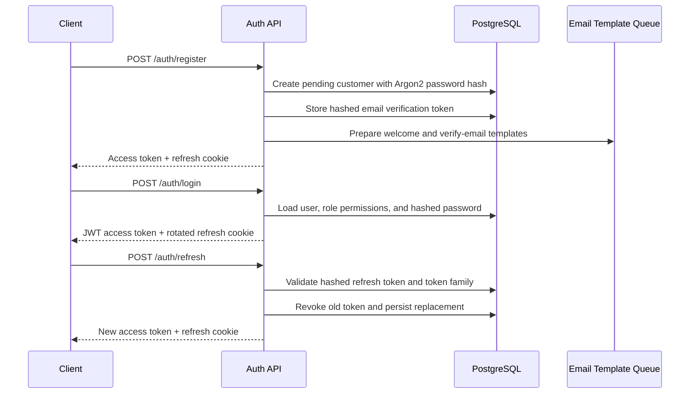
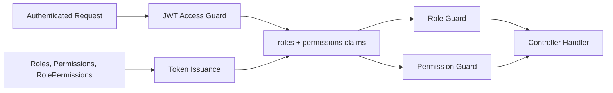

# API Documentation

Swagger is mounted at:

```text
GET /api/docs
```

All API routes use the prefix:

```text
/api/v1
```

## Authentication and User Management

```text
POST /api/v1/auth/register
POST /api/v1/auth/login
POST /api/v1/auth/logout
POST /api/v1/auth/refresh
POST /api/v1/auth/forgot-password
POST /api/v1/auth/reset-password
POST /api/v1/auth/change-password
POST /api/v1/auth/verify-email
GET  /api/v1/auth/me

GET    /api/v1/users/me
GET    /api/v1/users
POST   /api/v1/users
GET    /api/v1/users/:id
PATCH  /api/v1/users/profile
PATCH  /api/v1/users/:id
DELETE /api/v1/users/:id

GET   /api/v1/profile
PATCH /api/v1/profile

GET /api/v1/roles
GET /api/v1/roles/:code
POST /api/v1/roles
PATCH /api/v1/roles/:code
PUT /api/v1/roles/:code/permissions
POST /api/v1/roles/:code/permissions
POST /api/v1/roles/:code/permissions/remove

GET /api/v1/permissions

GET /api/v1/activity
```

Public endpoints are marked with the `@Public()` decorator. Protected endpoints require a bearer access token. Permission-gated endpoints use DB-backed permission codes such as `users.view`, `users.edit`, `users.delete`, `roles.view`, `permissions.view`, `profile.update`, and `activity.view`.

Refresh tokens are returned in the response for API clients and also written to the `vn_refresh_token` secure/httpOnly cookie. Refresh and logout accept either the body token or the cookie value.

## Auth Flow


```mermaid
sequenceDiagram
  participant Client
  participant AuthAPI as Auth API
  participant DB as PostgreSQL
  participant Email as Email Template Queue

  Client->>AuthAPI: POST /auth/register
  AuthAPI->>DB: Create pending customer with Argon2 password hash
  AuthAPI->>DB: Store hashed email verification token
  AuthAPI->>Email: Prepare welcome and verify-email templates
  AuthAPI-->>Client: Access token + refresh cookie

  Client->>AuthAPI: POST /auth/login
  AuthAPI->>DB: Load user, role permissions, and hashed password
  AuthAPI-->>Client: JWT access token + rotated refresh cookie

  Client->>AuthAPI: POST /auth/refresh
  AuthAPI->>DB: Validate hashed refresh token and token family
  AuthAPI->>DB: Revoke old token and persist replacement
  AuthAPI-->>Client: New access token + refresh cookie
```

## RBAC Flow


```mermaid
flowchart LR
  REQUEST["Authenticated Request"] --> JWT["JWT Access Guard"]
  JWT --> CLAIMS["roles + permissions claims"]
  CLAIMS --> ROLE["Role Guard"]
  CLAIMS --> PERMISSION["Permission Guard"]
  ROLE --> CONTROLLER["Controller Handler"]
  PERMISSION --> CONTROLLER
  DB["Roles, Permissions, RolePermissions"] --> TOKEN["Token Issuance"]
  TOKEN --> CLAIMS
```

Seeded roles are `CUSTOMER`, `TRAVEL_AGENT`, and `ADMIN`. Milestone 8 adds dynamic role creation, role metadata edits, full permission replacement, incremental permission assignment, and permission removal through `roles.manage`.

## Module Health and Capability Routes

Every non-auth bounded context exposes:

```text
GET /api/v1/{module}/health
GET /api/v1/{module}/capabilities
```

`health` is public for deployment checks. `capabilities` requires the `ADMIN` role.

Production health probes:

```text
GET /api/v1/health
GET /api/v1/health/live
GET /api/v1/health/ready
GET /api/v1/maintenance
PATCH /api/v1/maintenance
GET /api/v1/metrics/prometheus
```

Health/capability modules:

```text
customer
agent
admin
booking
reservation
passenger
search
ticket
booking-history
timeline
seat
tracking
notification
analytics
cms
offers
coupons
supplier
integration
payment
ai
settings
reports
audit
```

## Milestone 10 Integration Routes

```text
GET   /api/v1/integrations/health
GET   /api/v1/integrations/dashboard
GET   /api/v1/integrations/suppliers
PATCH /api/v1/integrations/suppliers/:code
GET   /api/v1/integrations/supplier-priority
POST  /api/v1/integrations/suppliers/:code/test-connection
GET   /api/v1/integrations/logs
GET   /api/v1/integrations/configuration

GET  /api/v1/payments/providers
GET  /api/v1/payments/transactions
POST /api/v1/payments/intents
POST /api/v1/payments/intents/:paymentIntentId/capture
POST /api/v1/payments/webhooks/:provider
```

Integration routes never expose supplier credentials or payment secrets. Live supplier and gateway adapters return not-configured responses until real secret references are configured.

Milestone 8 operational modules for feature flags, platform settings, supplier configuration, and monitoring expose the direct admin routes listed below.

Supplier also exposes:

```text
GET /api/v1/supplier/adapters
```

## Enterprise Admin API

Milestone 8 admin APIs are protected by `ADMIN` roles or management permissions. Dashboard, analytics, reports, and booking views are counted from real bookings and accounts; audit logs read the activity log. Coupons, offers, CMS pages, and generated reports start empty and are kept in memory. No payment gateways, analytics warehouses, monitoring vendors, or storage providers are integrated.

```text
GET  /api/v1/admin/dashboard
GET  /api/v1/admin/bookings
GET  /api/v1/admin/bookings/:bookingId
POST /api/v1/admin/bookings/:bookingId/resend-email

GET   /api/v1/admin/email-templates
PATCH /api/v1/admin/email-templates/:key
POST  /api/v1/admin/email-templates/:key/preview

GET  /api/v1/cms/pages
POST /api/v1/cms/pages
PATCH /api/v1/cms/pages/:pageId
POST /api/v1/cms/pages/:pageId/publish

GET  /api/v1/coupons
POST /api/v1/coupons
PATCH /api/v1/coupons/:couponId
POST /api/v1/coupons/:couponId/toggle

GET  /api/v1/offers
POST /api/v1/offers
PATCH /api/v1/offers/:offerId
POST /api/v1/offers/:offerId/toggle

GET  /api/v1/admin/notifications
POST /api/v1/admin/notifications/send

GET  /api/v1/reports/admin
POST /api/v1/reports/admin

GET  /api/v1/analytics/dashboard
GET  /api/v1/audit/logs
GET  /api/v1/activity

GET   /api/v1/feature-flags
PATCH /api/v1/feature-flags/:flagId

GET   /api/v1/platform-settings
PATCH /api/v1/platform-settings/:settingId

GET   /api/v1/supplier-configurations
PATCH /api/v1/supplier-configurations/:supplierId

GET  /api/v1/monitoring
```

Admin booking filters:

```text
search
status
operator
source
destination
journeyDate
sortBy
sortDirection
page
pageSize
```

Admin report generation request:

```json
{
  "name": "Monthly Revenue",
  "type": "REVENUE",
  "period": "MONTHLY",
  "format": "CSV"
}
```

Feature flag update request:

```json
{
  "enabled": true,
  "rolloutPercentage": 75,
  "description": "Enable coupon stacking for admin validation."
}
```

Supplier configuration records are placeholders only. They store enablement, priority, environment, owner, health, and credential-reference metadata without creating any BCI, RedBus, AbhiBus, TBO, or Custom API client.

## Milestone 9 Performance And Operations API

Milestone 9 APIs are architecture-first. Redis and BullMQ are modeled as platform boundaries, but no job is processed through them yet, so queues report empty and the scheduler lists no jobs. Monitoring reports live CPU and memory readings and the real health checks. No payment, SMS, WhatsApp, push, OpenAI/LLM, monitoring vendor, or storage provider is integrated.

Public health endpoints intentionally sit outside the versioned prefix:

```text
GET /api/health
GET /api/ready
GET /api/live
```

Versioned operational APIs:

```text
GET  /api/v1/ai/recommendations
POST /api/v1/ai/recommendations/recently-viewed

GET    /api/v1/notifications
GET    /api/v1/notifications/center
POST   /api/v1/notifications/:id/read
POST   /api/v1/notifications/mark-all-read
POST   /api/v1/notifications/:id/archive
DELETE /api/v1/notifications/:id

GET  /api/v1/cache
POST /api/v1/cache/warm

GET  /api/v1/queues
POST /api/v1/queues/enqueue

GET  /api/v1/scheduler/jobs
POST /api/v1/scheduler/jobs/:jobId/run

GET /api/v1/metrics
GET /api/v1/monitoring

GET  /api/v1/search/suggestions
POST /api/v1/search/recent
GET  /api/v1/search/insights

GET /api/v1/seo/metadata
GET /api/v1/seo/sitemap
```

AI recommendation response includes `engine: "RULES"` — the cheapest and fastest bus from a recent real search — and an explicit architecture block showing `modelProvider: "NONE"` and the future provider port. Cache responses identify `provider: "REDIS"`. Queue responses identify `driver: "BULLMQ"` and include retry/dead-letter state.

## Search API

Search is public and runs through `SupplierManagerService`, which fans out to every configured supplier — today SRDV (Bus API v9). With no supplier configured, a search returns no buses and a `notice` saying search is unavailable.

```text
POST /api/v1/search
GET  /api/v1/search/cities?q=bang
```

Example request:

```json
{
  "sourceCity": "Bangalore",
  "destinationCity": "Hyderabad",
  "journeyDate": "2026-11-02",
  "passengerCount": 1,
  "busTypes": ["Volvo A/C Sleeper (2+1)"],
  "ac": true,
  "minPrice": 700,
  "maxPrice": 2500,
  "sortBy": "PRICE_ASC",
  "page": 1,
  "pageSize": 12
}
```

Response shape:

```json
{
  "success": true,
  "totalResults": 24,
  "buses": [],
  "filters": {
    "price": { "min": 599, "max": 3199 },
    "departureWindows": [],
    "arrivalWindows": [],
    "busTypes": [],
    "operators": [],
    "amenities": [],
    "availableSeats": { "min": 0, "max": 48 },
    "ratings": []
  },
  "pagination": {
    "page": 1,
    "pageSize": 12,
    "totalPages": 2,
    "hasNextPage": true,
    "hasPreviousPage": false
  }
}
```

When a search finds nothing because a supplier said why — a city SRDV has no code for, or an outage — the response carries a traveller-facing `notice`.

- Bus type and amenity filter options are built from the buses returned, since suppliers name bus types freely.
- Departure and arrival windows are by the hour in India (IST).
- `ratings` stays empty: SRDV reports no ratings, so the rating filter is not offered.
- The default sort is `DEPARTURE_ASC`. `PRICE_ASC`, `PRICE_DESC`, `ARRIVAL_ASC`, `FASTEST`, and `DURATION_ASC` are also supported.

`GET /search/cities` returns up to 10 `{ name, state }` matches from SRDV's city list plus any `SRDV_CITY_CODES` additions, best match first.

## Seat, Booking, Ticket, And History API

Every route except the seat map requires a signed-in user, and each user sees only their own bookings (admins see all). Seat maps, blocks, bookings, and cancellations go to the trip's supplier. A trip must come from a search in the last 30 minutes; an older one answers `410 Gone` with a message asking to search again.

```text
GET  /api/v1/seats/:tripId?date=2026-11-02
GET  /api/v1/bookings
GET  /api/v1/bookings/history
GET  /api/v1/bookings/upcoming
GET  /api/v1/bookings/past
GET  /api/v1/bookings/cancelled
GET  /api/v1/bookings/:id
GET  /api/v1/bookings/:id/timeline
POST /api/v1/bookings/create
POST /api/v1/bookings/cancel
GET  /api/v1/tickets/:bookingId
GET  /api/v1/tickets/:bookingId/pdf
POST /api/v1/tickets/email
GET  /api/v1/notifications
POST /api/v1/notifications/:id/read
POST /api/v1/notifications/mark-all-read
```

Create booking request. This one call blocks the seats with the supplier, saves the booking, books it, and returns the booking with the ticket the supplier issued:

```json
{
  "supplierCode": "SRDV",
  "tripId": "<tripId from the search result>",
  "journeyDate": "2026-11-02",
  "selectedSeats": ["L1"],
  "boardingPointId": "<boarding point id from the seat map>",
  "droppingPointId": "<dropping point id from the seat map>",
  "passengers": [
    {
      "seatNumber": "L1",
      "firstName": "Asha",
      "lastName": "Rao",
      "age": 31,
      "gender": "FEMALE",
      "phone": "+919000000001",
      "email": "asha@example.com"
    }
  ]
}
```

- Seats are checked against the supplier's live seat map first: a seat sold since the map was opened answers `409`, and a women-only seat booked for a man answers `400`.
- No payment is collected; there is no payment gateway yet.
- A booking the supplier refuses is saved as `FAILED`.

Cancel booking request. The supplier cancels seat by seat and accepts before it settles, so the booking moves to `CANCELLATION_REQUESTED` with the refund pending:

```json
{
  "bookingId": "<booking id>",
  "reason": "Traveller requested cancellation"
}
```

Reschedule is not offered: SRDV has no reschedule operation.

Ticket download returns a JSON envelope with `ticketId`, `fileName`, `mimeType: "application/pdf"`, `downloadStatus`, `downloadedAt`, and the base64 PDF, built from the booking and the PNR and ticket number the supplier issued.

## B2B Travel Agent API

Agent routes require the `TRAVEL_AGENT` role. Agents book through the same supplier flow as travellers; their bookings are stored against their own account, and each agent sees only their own bookings and customers.

```text
GET    /api/v1/agent/dashboard

GET    /api/v1/agent/customers
GET    /api/v1/agent/customers/:id
POST   /api/v1/agent/customers
PATCH  /api/v1/agent/customers/:id
DELETE /api/v1/agent/customers/:id

GET    /api/v1/agent/bookings
POST   /api/v1/agent/bookings
POST   /api/v1/agent/bookings/email-ticket

GET    /api/v1/agent/reports
GET    /api/v1/agent/notifications
```

Agent booking create request: the normal booking request plus `customerId` (one of the agent's customers) and `emailTicket`. Each passenger's name and age are entered per seat; the customer's phone and email are the contact details.

Agent booking filters:

```text
journeyDate
operator
status
source
destination
bookingId
customerName
phoneNumber
search
sortBy
sortDirection
page
pageSize
```

## Future API Expansion

Later milestones should add booking use-case endpoints rather than controller-heavy CRUD. Examples:

```text
POST /api/v1/bookings/{bookingId}/block-seats
POST /api/v1/bookings/{bookingId}/cancel
POST /api/v1/bookings/{bookingId}/reschedule
POST /api/v1/payments/intent
POST /api/v1/payments/webhook
```
