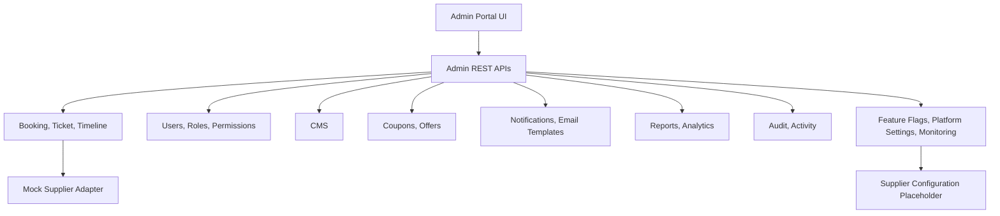

# Admin Portal Architecture

Milestone 8 adds the enterprise admin portal for Vriddhi Nexus Pvt Ltd. It is intentionally mock-backed and internal-service-backed. It does not add BCI, RedBus, AbhiBus, TBO, payment, SMTP, storage, analytics warehouse, monitoring vendor, or live tracking integrations.

## Frontend

`apps/web/components/admin-portal.tsx` owns the reusable admin workspaces. Routes under `apps/web/app/admin` render those workspaces inside the shared dashboard shell.

Admin navigation includes Dashboard, Bookings, Users, Travel Agents, Customers, Roles, Coupons, Offers, CMS, Notifications, Email Templates, Reports, Analytics, Audit Logs, Activity Logs, Platform Settings, Feature Flags, System Monitoring, Supplier Configuration, and Profile.

Admin tables use `@vnbus/ui` `DataTable` for global search, sorting, pagination, column visibility, responsive layout, bulk actions, CSV export, and print/PDF export. Charts use Recharts with chart-ready API contracts.

## Backend

Milestone 8 admin modules follow the same bounded-context shape as earlier milestones:

```text
controller -> service -> repository -> entity/DTO/validator -> tests
```

Primary modules:

- `admin`: dashboard, booking management, booking email resend, and email templates.
- `role`: dynamic role creation and permission assignment.
- `cms`: CMS page drafts, edits, and publishing.
- `coupons` and `offers`: promotion management.
- `notification`: admin notification center and send action.
- `reports` and `analytics`: report generation metadata and chart projections.
- `audit` and `activity`: investigation logs.
- `feature-flag`: rollout controls.
- `platform-settings`: brand, support, timezone, currency, tax, fee, and policy settings.
- `supplier-configuration`: architecture-only supplier configuration placeholders.
- `monitoring`: mock component health snapshots.

## Dependency Diagram



The admin portal is a control plane over existing platform contracts. Supplier-specific response shapes must not leak into admin UI or API responses.
