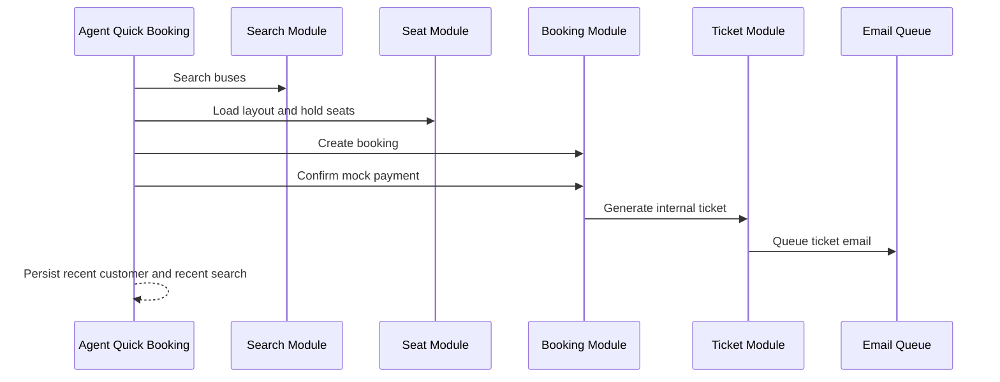

# Agent Portal Architecture

Milestone 7 adds the B2B travel-agent portal without adding supplier APIs or a second booking engine.

## Modules

- `agent`: dashboard profile, metrics, popular routes, activity, and notification rollups.
- `customer`: agent-managed customers, notes, tags, profile details, booking history, and upcoming trips.
- `agent-booking`: agent booking orchestration over the existing booking and ticket services.
- `agent-report`: mock report projections and export metadata.
- `agent-notification`: agent-specific notification center feed.

## Booking Flow

## Future Integration Strategy

Future supplier integrations should continue to map supplier responses into the internal search, seat, booking, and ticket models. Agent workflows should not consume BCI, RedBus, AbhiBus, TBO, or Custom supplier response shapes directly.
