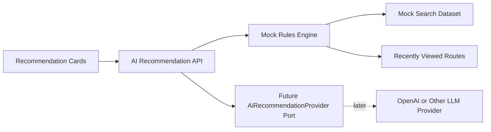

# AI Recommendation Guide

Milestone 9 adds an AI recommendation module without integrating OpenAI or any LLM provider.

## Recommendation Types

- Cheapest Route.
- Fastest Route.
- Popular Route.
- Best Rated Operator.
- Weekend Suggestions.
- Nearby Destination Suggestions.
- Frequently Booked Routes.
- Recently Viewed Routes.
- Trending Routes.
- Recently Booked Again.

## API

```text
GET  /api/v1/ai/recommendations
POST /api/v1/ai/recommendations/recently-viewed
```

## Architecture



The response exposes `engine: "MOCK_RULES"`, `modelProvider: "NONE"`, and a future provider port name. Future LLM output should pass ranking, safety, policy, and supplier-neutral normalization before reaching users.

## Future Work

Future work can add embeddings, personalized route ranking, trip history features, consent controls, safety checks, LLM fallbacks, and A/B tested ranking through feature flags.
