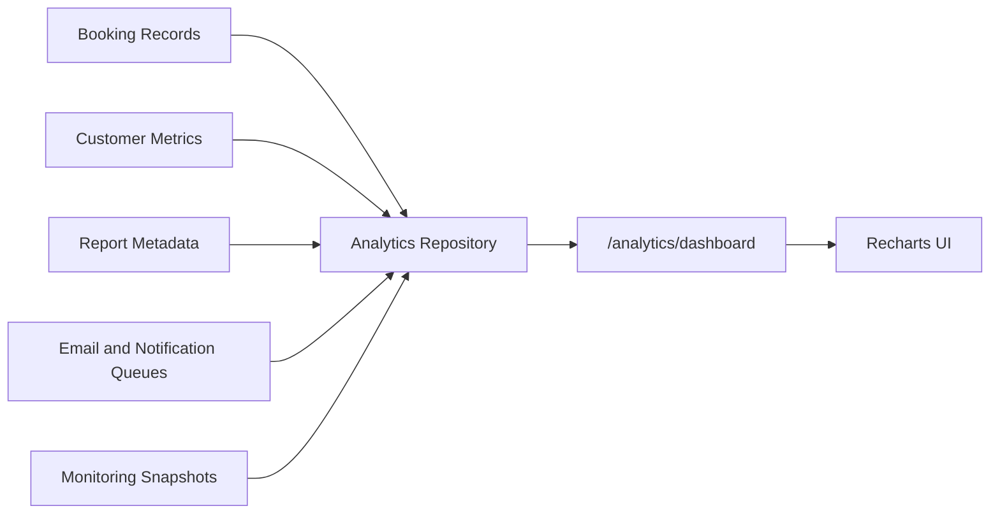

# Analytics Architecture

Milestone 8 analytics are mock projections shaped for admin dashboards and reports. They do not call external analytics tools, warehouses, supplier APIs, payment systems, or monitoring vendors.

## Sources

Admin analytics combine internal mock booking, customer, operator, route, revenue, cancellation, queue, and system-health snapshots.

## Snapshot Table

`analytics_snapshots` stores metric key, period, chart points, summary JSON, and snapshot timestamp. Milestone 8 uses in-memory data, but the table is ready for scheduled snapshots later.

## Future Work

Production analytics can add BullMQ snapshot jobs, warehouse exports, retention cohorts, operator settlement reports, and immutable generated report files while preserving chart-ready response contracts.
