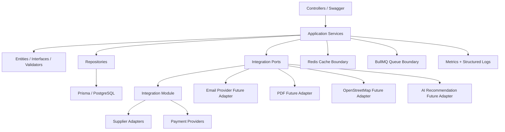
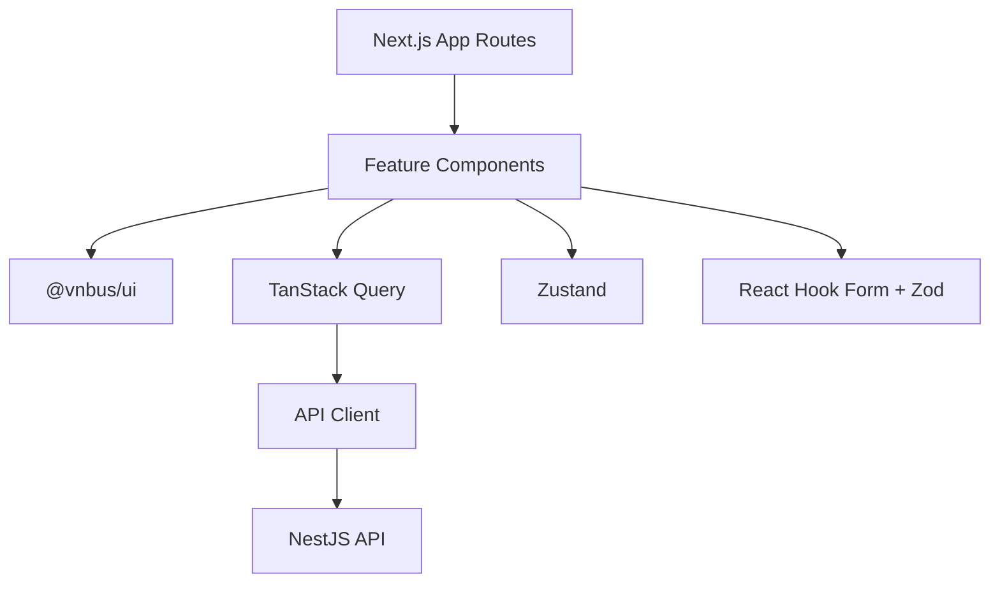
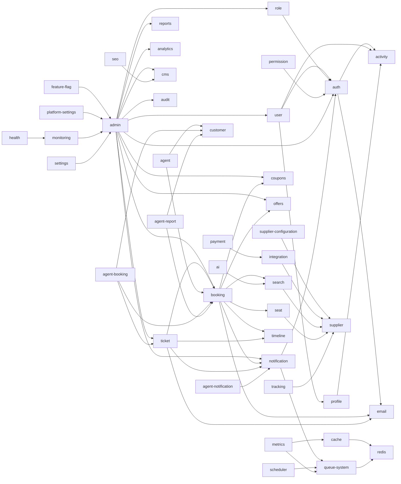
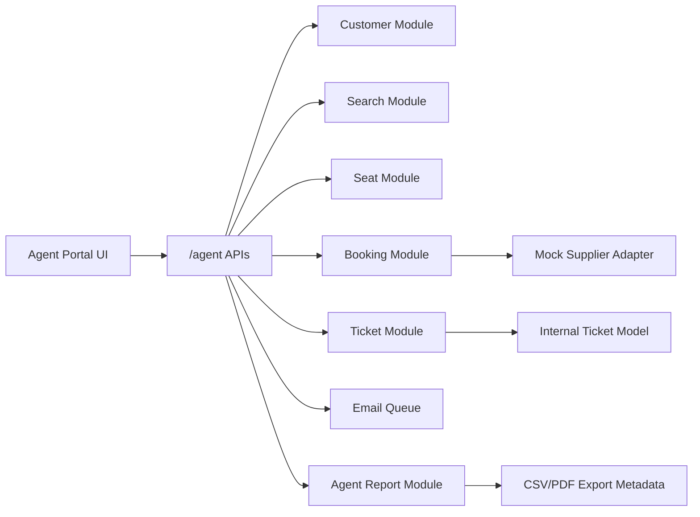
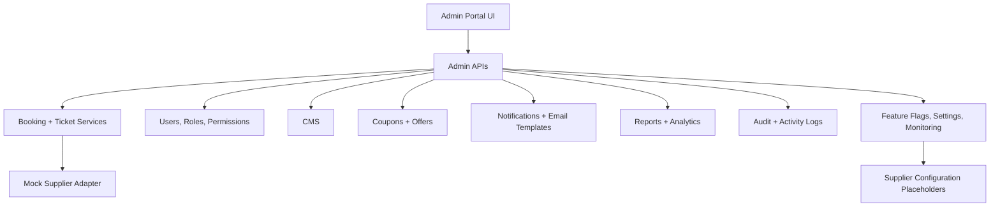
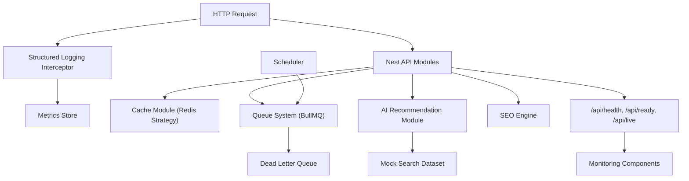
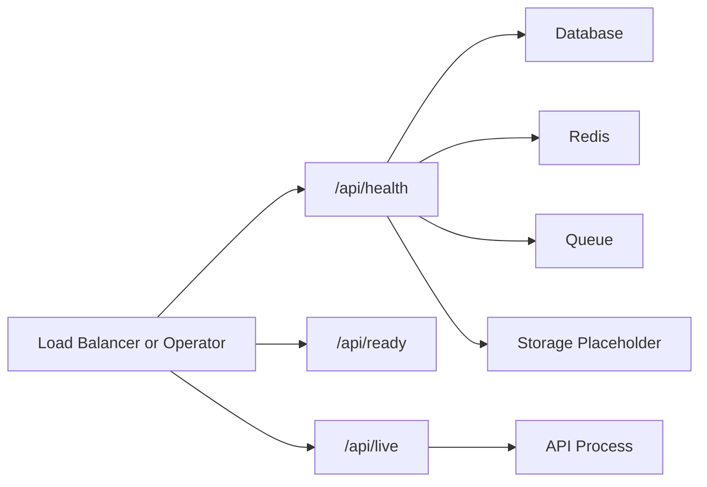
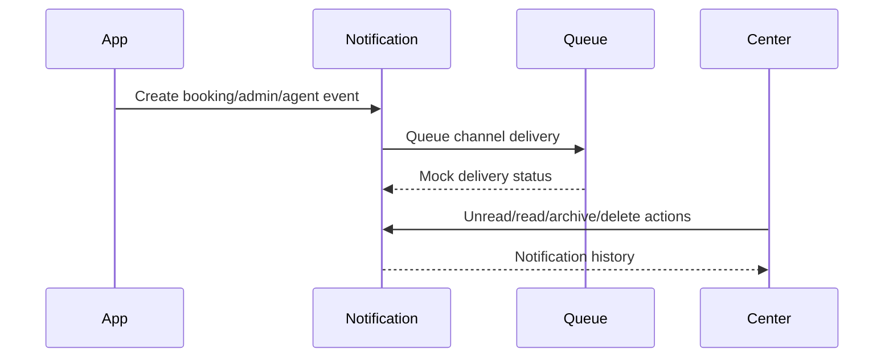

# Architecture

## Architectural Style

The platform follows Clean Architecture with DDD module boundaries. User-facing flows enter through controllers or pages, application services coordinate use cases, repositories isolate persistence, and integrations are represented as ports/adapters.

The project is not a SaaS clone. It is a single enterprise booking platform for Vriddhi Nexus Pvt Ltd with role-specific surfaces for customers, travel agents, and admins. There is no Operator role in the current platform boundary.

## Monorepo Decisions

- Turborepo coordinates builds, linting, type checks, and tests across apps and packages.
- Shared contracts live in `packages/types` and `packages/shared` to prevent duplicated DTO semantics.
- UI primitives live in `packages/ui` and follow shadcn-style composition with restrained enterprise styling.
- Supplier contracts live in `packages/supplier-sdk`, separate from both API persistence and UI concerns.
- Payment provider contracts live in `apps/api/src/modules/payment` and are routed through `PaymentService`.

## Backend Layers

## Frontend Layers

## Module Dependency Diagram

Dependencies point toward stable abstractions. Real supplier, payment, email, PDF, live map, and AI integrations remain behind interfaces until later milestones.

## Milestone 10 Integration Layer

The integration layer follows Adapter, Strategy, and Factory-style registration:

- `SupplierManagerService` registers suppliers, applies enable/disable state, priority, timeout, retry, failover, request logging, health tracking, and circuit breaker rules.
- `NormalizationService` converts supplier output into internal models consumed by search, seat, booking, ticket, and admin workflows.
- `DuplicateTripDetectionService` flags potential duplicate inventory without merging supplier records.
- `PaymentService` owns payment provider selection, mock payment intent/capture, webhook verification, duplicate webhook protection, and transaction logging.
- `IdempotencyService` and `DistributedLockService` prepare critical operations for repeated requests and Redis-backed locking.

## Security Decisions

- Helmet is enabled globally.
- CORS is configured from environment variables.
- Nest validation pipes use transform, whitelist, and forbidden unknown fields.
- JWT access tokens carry role and permission claims.
- Refresh tokens are persisted hashed, grouped by token family, and rotated on refresh.
- Passwords use Argon2id hashing.
- RBAC is enforced by global guards plus role and permission decorators.
- Activity logs capture authentication and user-management events with request metadata.
- Secret values are modeled as references in settings rather than raw secret storage.

## Email Architecture

Email delivery remains provider-free. `EmailTemplateService` renders templates, `EmailQueueService` creates queue records, `EmailLoggerService` stores architecture-only email logs, and `EmailRetryStrategy` calculates retry windows. Booking and ticket services use the queue service for booking confirmation, cancellation, reschedule, password reset, welcome, and verification templates. SMTP/provider adapters can be added later behind this boundary without changing booking or ticket use cases.

## Ticket Architecture

Tickets are supplier-independent internal records. `TicketMapper` maps confirmed `BookingRecord` data into `TicketRecord`, including mock PNR, route, passenger, seat, fare, support, and QR payload fields. `TicketService` persists generated tickets, records PDF downloads, logs ticket-email actions, appends booking timeline events, and creates notifications. Future supplier responses should map into the internal ticket model before reaching controllers or frontend state.

## Supplier Adapter Architecture

`packages/supplier-sdk` defines `SupplierAdapter`:

- `searchTrips()`
- `getSeatLayout()`
- `holdSeats()`
- `releaseSeats()`
- `blockSeats()`
- `confirmBooking()`
- `cancelBooking()`
- `rescheduleBooking()`
- `trackBus()`
- `downloadTicket()`

Milestone 8 still uses `MockSupplierAdapter` for search, seat layout, seat hold, release, and mock confirmation behavior. Ticket generation, PDF output, email logs, notifications, cancellation, reschedule, agent booking, admin booking management, analytics, reports, and monitoring are internal mock services. The real supplier adapters, including `BCIAdapter`, `RedBusAdapter`, `AbhiBusAdapter`, `TBOAdapter`, and `CustomAdapter`, remain intentionally unimplemented until supplier integration work begins.

## Agent Portal Architecture

Milestone 7 adds a B2B travel-agent surface without creating a second booking engine.
Agent quick booking calls the same search, seat layout, seat hold, booking creation,
booking confirmation, ticket generation, and ticket email services as the customer
portal. Agent-specific modules add orchestration, ownership metadata, customer
management, report projections, and notification feeds.

Agent-only state is intentionally thin:

- Customer filters, booking filters, recent customers, and recent searches persist in the web app.
- Booking, ticket, timeline, and notification state continues to use the shared M6 store and APIs.
- Backend agent repositories remain mock/in-memory until a real persistence milestone wires them to Prisma.

## Admin Portal Architecture

Milestone 8 adds an enterprise admin portal without introducing third-party supplier, payment, email, analytics, or monitoring integrations. The admin UI uses a single workspace component with role-specific routes, shared charts, and the reusable `DataTable` for search, sorting, filtering, column visibility, bulk actions, CSV export, and print/PDF export.

Admin modules follow the same controller, service, repository, DTO, entity, validator, and test structure as earlier milestones. Some repositories remain in-memory for Milestone 8 while Prisma tables and migrations define the future persistence target.

## Analytics Architecture

Admin analytics use chart-ready projections rather than raw transaction exports. `analytics`, `reports`, and `admin` repositories return snapshots for revenue, bookings, cancellations, customer activity, operator performance, route performance, queue health, and system status. A later production analytics milestone can replace these mock projections with warehouse-backed or snapshot-table-backed data without changing the frontend chart contracts.

## Feature Flag Architecture

Feature flags are admin-managed records with owner, environment, rollout percentage, active status, and description metadata. Milestone 8 treats them as platform controls and documentation-ready contracts. Runtime flag evaluation, SDK exposure, environment inheritance, approval workflows, and audit-enforced rollout history remain future work.

## Milestone 9 Operations Architecture

Milestone 9 turns performance and observability into explicit modules while keeping runtime behavior mock-backed.

### Cache Strategy

Redis cache namespaces cover popular routes, search results, autocomplete, popular searches, recent searches, operators, bus types, settings, feature flags, analytics, and dashboard widgets. Milestone 9 exposes warm-cache and status APIs; real Redis hydration and invalidation workers remain future work.

### Queue Strategy

BullMQ queue contracts cover email, notification, PDF, analytics, AI, scheduler, and dead-letter queues. Retry policy uses exponential backoff and routes exhausted jobs to the dead-letter queue. Milestone 9 models processors and queue status without implementing production workers.

### Health Check Flow

### Notification Flow

### AI Recommendation Architecture

The recommendation engine uses deterministic rules over mock search data for cheapest, fastest, popular, best-rated, weekend, nearby, frequent, recent, trending, and repeat-booking suggestions. The response includes `modelProvider: "NONE"` and a future `AiRecommendationProvider` port so OpenAI or another LLM can be plugged in later without changing controller or frontend contracts.
