# Booking Flow Documentation

Milestone 5 implements a complete mock-backed booking journey:

```mermaid
flowchart LR
  SEARCH["Search Results"] --> SEATS["View Seats"]
  SEATS --> LAYOUT["Seat Layout"]
  LAYOUT --> SELECT["Select Seats"]
  SELECT --> BOARDING["Boarding Point"]
  BOARDING --> DROPPING["Dropping Point"]
  DROPPING --> PASSENGER["Passenger Details"]
  PASSENGER --> REVIEW["Booking Review"]
  REVIEW --> CONFIRM["Booking Confirmation"]
  CONFIRM --> TICKET["Ticket"]
```

Runtime behavior:

- Search result cards pass `tripId` and `journeyDate` into `/seat-layout`.
- Seat selection calls the mock seat layout engine and allows up to six seats.
- Continuing from seat selection creates a ten-minute mock hold.
- Passenger details are persisted in `vnbus-booking-flow` Zustand storage.
- Booking review creates a pending-payment booking and confirms it with `MOCK-PAYMENT-SUCCESS`.
- Confirmation generates a mock PNR, ticket number, email-prepared event, ticket view, and downloadable base64 PDF.
- Ticket displays Live Tracking as Coming Soon for future provider integration.

Failure behavior:

- Expired holds release seats and redirect back to seat selection.
- Incomplete sessions render recovery states.
- Booking confirmation errors route to `/booking-failed`.
