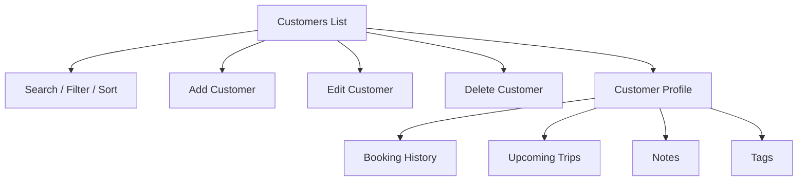

# Customer Management

Milestone 7 customer management supports agent-owned traveller records for high-volume booking desks.

## Customer Profile

Agent customers store:

- Name, email, phone, gender, date of birth, and emergency contact.
- Preferred routes.
- Notes with author and timestamp.
- Tags with label and color.
- Booking count, upcoming trip count, lifetime value, and last booked timestamp.

## Flow

## Error Handling

- Duplicate Customer: matched by email or phone.
- Customer Not Found: returned for detail, update, delete, or booking attempts.
- Blocked Customer: rejected before agent booking creation.

The current runtime uses in-memory mock repositories and local web persistence. Prisma tables are ready for a future persistence milestone.
