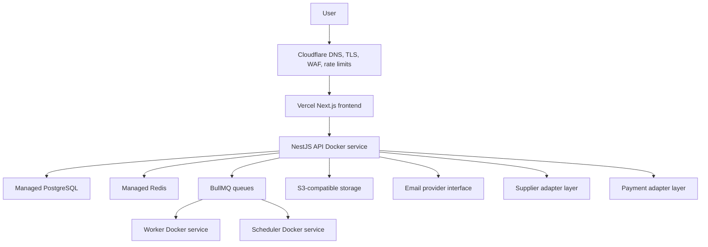

# Deployment

Milestone 11 prepares the platform for production deployment without connecting live supplier APIs or a live payment gateway.

## Target Architecture



## Environments

- Development: `.env.development`, local Docker PostgreSQL/Redis, mock supplier, mock payment.
- Test: `.env.test`, isolated test database, mock supplier, mock payment.
- Staging: `.env.staging`, production-shaped infrastructure, mock supplier, mock payment.
- Production: `.env.production`, production infrastructure and secret references, mock supplier/payment until onboarding is complete.

## Frontend Deployment

- Deploy `apps/web` to Vercel from the monorepo using `vercel.json`.
- Set only public variables in Vercel: `NEXT_PUBLIC_API_URL` and `NEXT_PUBLIC_MAINTENANCE_MODE`.
- Keep backend secrets out of Vercel client variables.
- Configure the production domain behind Cloudflare and point it to Vercel.

Recommended Vercel settings:

- Production branch: `main`
- Build command: `pnpm --filter @vnbus/web build`
- Install command: `pnpm install --frozen-lockfile`
- Output directory: `apps/web/.next`
- Preview deployments: use staging API URL and mock supplier/payment.

## Cloudflare

Recommended Cloudflare setup:

- DNS proxied for the frontend domain.
- TLS mode set to full/strict when the origin supports it.
- Always HTTPS enabled.
- WAF rules enabled for common application attacks.
- Rate limits for auth, search, booking, and admin paths.
- Bot protection enabled for public search and auth routes.
- Cache only static frontend assets; do not cache authenticated, booking, payment, supplier, admin, or API mutation routes.
- Add security headers at the edge only when they do not conflict with app headers.

## Backend Deployment

Build separate images:

```bash
docker build -f apps/api/Dockerfile -t vnbus-api .
docker build -f apps/api/Dockerfile.worker -t vnbus-worker .
docker build -f apps/api/Dockerfile.scheduler -t vnbus-scheduler .
docker build -f apps/web/Dockerfile -t vnbus-web .
```

Run separate services:

- API: `node dist/main.js`
- Worker: `node dist/worker.js`
- Scheduler: `node dist/scheduler.js`

### Free Backend Setup: Render + Neon + Upstash

This is the recommended temporary hosting setup while supplier and payment APIs remain in mock mode.

Use:

- Vercel for the frontend.
- Render Free Web Service for `apps/api`.
- Neon Free Postgres for `DATABASE_URL`.
- Upstash Redis Free for `REDIS_URL`.

Create the Neon database:

1. Create a Neon project.
2. Copy the PostgreSQL connection string for the default database.
3. Keep `?sslmode=require` in the URL.
4. Use that value as `DATABASE_URL` in Render and in local migration commands.

Create the Upstash Redis database:

1. Create an Upstash Redis database.
2. Copy the Redis connection string.
3. Use that value as `REDIS_URL` in Render.

Deploy the API on Render:

1. Create a Render Web Service from the GitHub repo.
2. Use Docker deployment with `apps/api/Dockerfile`.
3. Set the Docker context/root to the repository root.
4. Set health check path to `/api/v1/health/live`.
5. Render injects `PORT`; the API also supports `API_PORT` as a local fallback.

Required Render environment variables:

```env
NODE_ENV=production
APP_NAME=Vriddhi Nexus Bus
APP_URL=https://your-vercel-app.vercel.app
API_URL=https://your-render-api.onrender.com
CORS_ORIGIN=https://your-vercel-app.vercel.app
DATABASE_URL=postgresql://...
REDIS_URL=redis://...
JWT_ACCESS_SECRET=replace-with-at-least-24-characters
JWT_REFRESH_SECRET=replace-with-at-least-24-characters
COOKIE_SECURE=true
SUPPLIER_MODE=mock
PAYMENT_PROVIDER=MOCK
EMAIL_PROVIDER=mock
NEXT_PUBLIC_MAINTENANCE_MODE=false
MAINTENANCE_MODE=false
```

Run Neon migrations before using the hosted API:

```bash
DATABASE_URL="postgresql://..." pnpm --filter @vnbus/api prisma:deploy
DATABASE_URL="postgresql://..." pnpm --filter @vnbus/api prisma:seed
```

Set Vercel frontend variables:

```env
NEXT_PUBLIC_API_URL=https://your-render-api.onrender.com
NEXT_PUBLIC_MAINTENANCE_MODE=false
```

Render Free Web Services sleep after idle time, so the first API request can be slow. Neon and Upstash avoid the 30-day database expiry problem from Render Postgres.

## Migration Procedure

1. Take a verified database backup.
2. Run `pnpm db:generate`.
3. Run Prisma migrations against staging.
4. Run smoke and production-style E2E tests.
5. Run migrations against production during an approved release window.
6. Deploy API, worker, scheduler, then frontend.

## Health Checks

- Liveness: `GET /api/v1/health/live`
- Readiness: `GET /api/v1/health/ready`
- Full health: `GET /api/v1/health`
- Prometheus metrics: `GET /api/v1/metrics/prometheus`

In staging/production, readiness reports `DOWN` when required database or Redis config is missing or still a placeholder.
