# Database ER Diagram

```mermaid
erDiagram
  USERS ||--o| CUSTOMERS : has
  USERS ||--o| AGENTS : has
  USERS }o--|| ROLES : primary_role
  USERS ||--o{ USER_ROLES : assigned
  ROLES ||--o{ USER_ROLES : contains
  ROLES ||--o{ ROLE_PERMISSIONS : grants
  PERMISSIONS ||--o{ ROLE_PERMISSIONS : included
  USERS ||--o{ REFRESH_TOKENS : owns
  USERS ||--o{ PASSWORD_RESET_TOKENS : requests
  USERS ||--o{ EMAIL_VERIFICATION_TOKENS : verifies
  USERS ||--o{ BOOKINGS : creates
  CUSTOMERS ||--o{ BOOKINGS : owns
  AGENTS ||--o{ BOOKINGS : manages
  BOOKINGS ||--o{ PASSENGERS : includes
  BOOKINGS ||--o{ TICKETS : issues
  COUPONS ||--o{ BOOKINGS : applies
  USERS ||--o{ NOTIFICATIONS : receives
  USERS ||--o{ AUDIT_LOGS : acts
  USERS ||--o{ ACTIVITY_LOGS : performs
  USERS ||--o{ REPORTS : requests
  USERS ||--o{ CMS_PAGES : updates
  USERS ||--o{ PLATFORM_SETTINGS : updates
  SUPPLIERS ||..o{ BOOKINGS : referenced_by_code
  CACHE_ENTRIES }o..o{ SEARCH_INSIGHTS : warms
  QUEUE_JOBS }o..o{ BACKGROUND_JOBS : schedules
  RECOMMENDATION_EVENTS }o..o{ SEARCH_INSIGHTS : ranks
  METRIC_SNAPSHOTS }o..o{ MONITORING_SNAPSHOTS : samples

  USERS {
    uuid id PK
    string first_name
    string last_name
    string email UK
    string phone UK
    string password
    string avatar
    uuid role_id FK
    enum status
    boolean email_verified
    datetime email_verified_at
    datetime last_login_at
    boolean force_password_change
    datetime deleted_at
    datetime created_at
    datetime updated_at
  }
  REFRESH_TOKENS {
    uuid id PK
    uuid user_id FK
    string token_hash
    uuid token_family
    datetime expires_at
    datetime revoked_at
    uuid replaced_by_token_id
    string ip_address
    string user_agent
  }
  PASSWORD_RESET_TOKENS {
    uuid id PK
    uuid user_id FK
    string token_hash
    datetime expires_at
    datetime consumed_at
    string ip_address
    string user_agent
  }
  EMAIL_VERIFICATION_TOKENS {
    uuid id PK
    uuid user_id FK
    string token_hash
    datetime expires_at
    datetime consumed_at
    string ip_address
    string user_agent
  }
  ROLES {
    uuid id PK
    string code UK
    string name
    boolean is_system
  }
  PERMISSIONS {
    uuid id PK
    string code UK
  }
  ACTIVITY_LOGS {
    uuid id PK
    enum actor_type
    uuid actor_user_id FK
    string action
    string entity_type
    string entity_id
    json metadata
  }
  BOOKINGS {
    uuid id PK
    string booking_reference UK
    uuid user_id FK
    uuid customer_id FK
    uuid agent_id FK
    string supplier_code
    enum status
    decimal total_amount
  }
  TICKETS {
    uuid id PK
    uuid booking_id FK
    string ticket_number UK
    enum status
  }
  CMS_PAGES {
    uuid id PK
    string key UK
    string title
    string section
    string status
    string content
    string seo_title
    string seo_description
    uuid updated_by_id FK
    datetime published_at
  }
  ANALYTICS_SNAPSHOTS {
    uuid id PK
    string metric_key
    string period
    json points
    json summary
    datetime snapshot_at
  }
  FEATURE_FLAGS {
    uuid id PK
    string key UK
    string name
    boolean enabled
    string audience
    int rollout_percentage
    string owner
  }
  PLATFORM_SETTINGS {
    uuid id PK
    string key UK
    string category
    string label
    json value
    boolean is_secret_reference
    uuid updated_by_id FK
  }
  SUPPLIER_CONFIGURATIONS {
    uuid id PK
    string code UK
    string name
    boolean enabled
    int priority
    string health_status
    string environment
    string api_key_secret_ref
    json configuration
  }
  MONITORING_SNAPSHOTS {
    uuid id PK
    string component
    string status
    int latency_ms
    decimal uptime_percentage
    json details
    datetime sampled_at
  }
  CACHE_ENTRIES {
    uuid id PK
    string cache_key UK
    string namespace
    string status
    int ttl_seconds
    int size_bytes
  }
  QUEUE_JOBS {
    uuid id PK
    string queue_name
    string job_name
    string status
    int attempts
    int max_attempts
    json payload
  }
  BACKGROUND_JOBS {
    uuid id PK
    string job_key UK
    string name
    string queue_name
    string schedule
    string status
  }
  SEARCH_INSIGHTS {
    uuid id PK
    string source_city
    string destination_city
    int search_count
    int no_result_count
    int abandoned_count
  }
  RECOMMENDATION_EVENTS {
    uuid id PK
    string recommendation_type
    string source_city
    string destination_city
    decimal confidence_score
    string model_provider
  }
  METRIC_SNAPSHOTS {
    uuid id PK
    string metric_key
    decimal value
    string unit
    json labels
  }
  SEO_ROUTES {
    uuid id PK
    string path UK
    string title
    string canonical_url
    json open_graph
    json twitter_card
    json json_ld
  }
```

Milestone 8 adds `cms_pages`, `analytics_snapshots`, `feature_flags`, `platform_settings`, `supplier_configurations`, and `monitoring_snapshots`. Existing `coupons`, `offers`, `reports`, `audit_logs`, `activity_logs`, `email_templates`, and `notifications` tables are reused for admin workflows, with notification types expanded for admin broadcast, customer message, agent message, and system events.

Milestone 9 adds `cache_entries`, `queue_jobs`, `background_jobs`, `search_insights`, `recommendation_events`, `metric_snapshots`, and `seo_routes`. These tables are persistence targets for Redis cache state, BullMQ job state, scheduled jobs, search analytics, mock AI recommendations, observability metrics, and SEO metadata. Runtime services remain mock-backed in Milestone 9.
