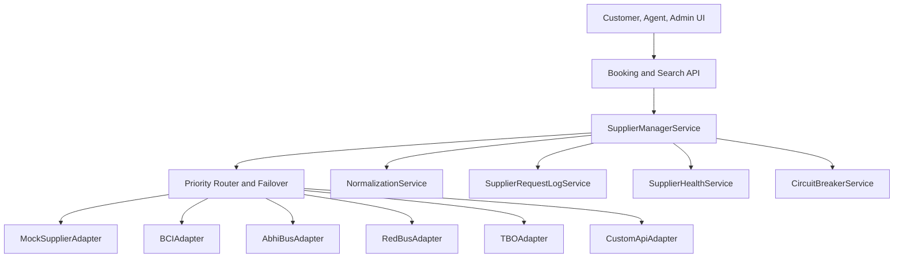
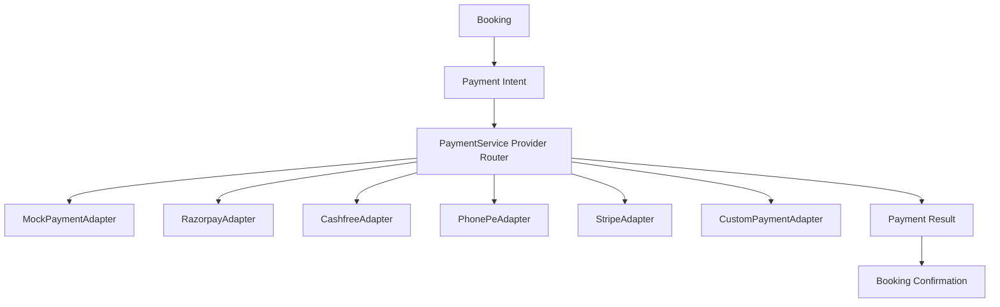

# Milestone 10 Integration Architecture

Milestone 10 adds the production integration layer without connecting real suppliers or payment gateways.

The frontend never talks to suppliers. It receives existing normalized search, seat, booking, ticket, and dashboard contracts.

Core rules:

- `SUPPLIER_MODE=mock` keeps `MockSupplierAdapter` active.
- `SUPPLIER_MODE=production` is supported by configuration, but live suppliers remain disabled until API URLs and secret references exist.
- Supplier failures are normalized into application-level statuses: `SUPPLIER_UNAVAILABLE`, `SEARCH_PARTIALLY_AVAILABLE`, and `NO_SUPPLIER_AVAILABLE`.
- Request logs record request IDs, correlation IDs, trace IDs, supplier code, operation, duration, outcome, and redacted metadata.
- Circuit breakers support `CLOSED`, `OPEN`, and `HALF_OPEN`.

Payment flow:

No payment gateway dependency is installed in Milestone 10.
