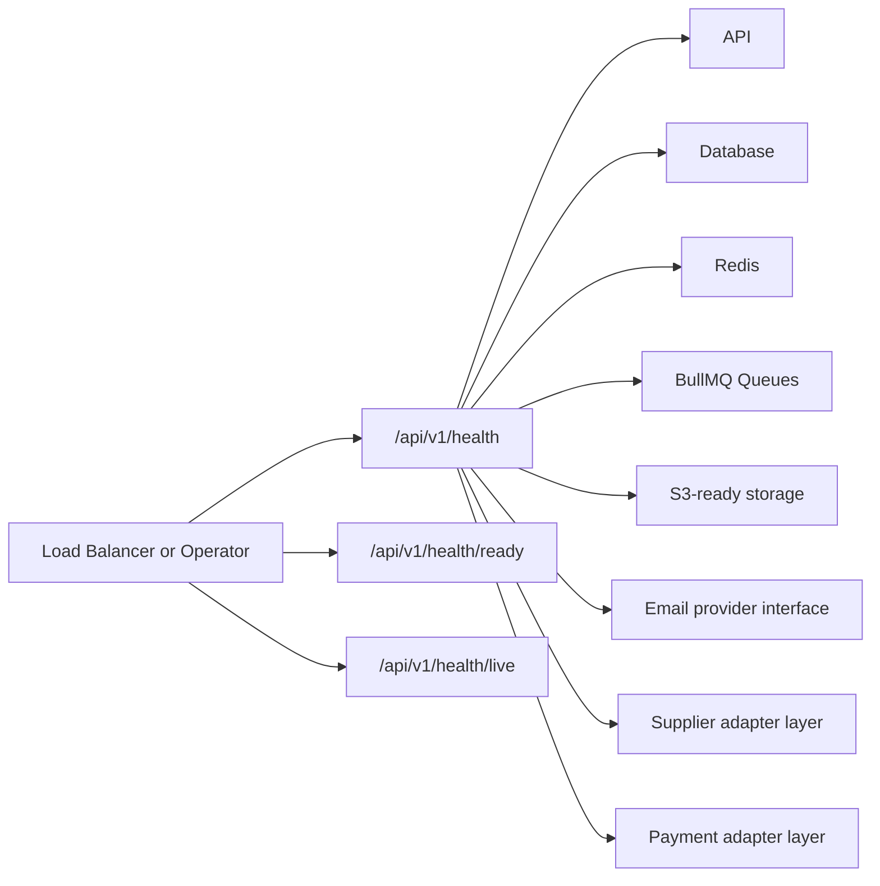

# Monitoring Guide

Milestone 11 updates monitoring, health checks, metrics, structured logs, and centralized error envelopes without integrating an external monitoring vendor.

## Endpoints

```text
GET /api/v1/health
GET /api/v1/health/ready
GET /api/v1/health/live
GET /api/v1/monitoring
GET /api/v1/metrics
GET /api/v1/metrics/prometheus
```

## Health Check Diagram



## Metrics

Metrics include request count, average API response time, error rate, queue status, cache status, memory usage, estimated process CPU usage, and infrastructure-supplied storage usage.

Structured logs include `correlationId`, `requestId`, and `traceId`. Exception responses include centralized error codes for validation, authentication, authorization, business-rule, and unknown errors.

Production work should add OpenTelemetry, log shipping, dashboards, alerting, SLOs, worker metrics, Redis metrics, database metrics, and trace propagation across background jobs.
