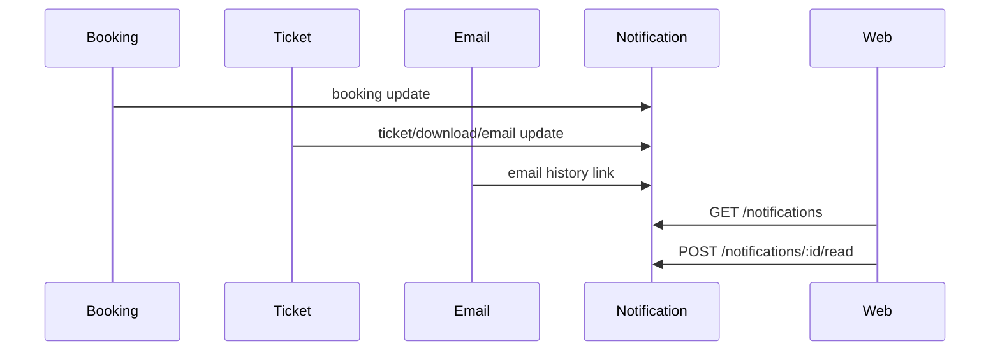

# Notification Architecture

Notifications are internal records for customer-facing booking events, agent events, and admin broadcast/system events.

## Flow

## Notification Types

- `BOOKING_UPDATE`
- `CANCELLATION_UPDATE`
- `RESCHEDULE_UPDATE`
- `EMAIL_HISTORY`
- `AGENT_BOOKING_CREATED`
- `AGENT_BOOKING_CANCELLED`
- `AGENT_JOURNEY_REMINDER`
- `AGENT_SYSTEM`
- `ADMIN_BROADCAST`
- `ADMIN_CUSTOMER_MESSAGE`
- `ADMIN_AGENT_MESSAGE`
- `ADMIN_SYSTEM`
- `BOOKING_CREATED`
- `BOOKING_CONFIRMED`
- `BOOKING_CANCELLED`
- `BOOKING_RESCHEDULED`
- `JOURNEY_REMINDER`
- `PASSWORD_CHANGED`
- `WELCOME`
- `ADMIN_ANNOUNCEMENT`
- `AGENT_ANNOUNCEMENT`

Records persist read/unread state in the frontend store today and are represented in Prisma through the `notifications` table for backend persistence.

Milestone 8 adds `/api/v1/admin/notifications` and `/api/v1/admin/notifications/send` for admin notification history, templates, queue status, and broadcast/customer/agent message workflows. Delivery remains mock-backed.

Milestone 9 adds `/api/v1/notifications/center`, archive, delete, and mark-all-read workflows. Supported channels are in-app and email, with SMS, WhatsApp, and push modeled as future-ready placeholders.
