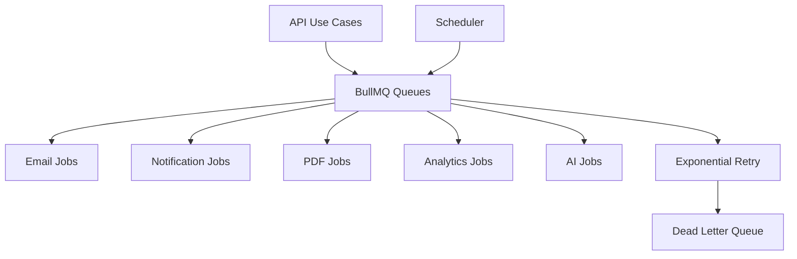

# Queue Guide

Milestone 9 models BullMQ queues and background job scheduling. It does not deploy production workers.

## Queues

- Email Queue.
- Notification Queue.
- PDF Queue.
- Analytics Queue.
- AI Queue.
- Scheduler Queue.
- Dead Letter Queue.

## API

```text
GET  /api/v1/queues
POST /api/v1/queues/enqueue
GET  /api/v1/scheduler/jobs
POST /api/v1/scheduler/jobs/:jobId/run
```

## Queue Architecture



## Background Jobs

Milestone 9 schedules expired seat cleanup, reservation cleanup, email retry, notification retry, analytics snapshot, daily reports, weekly reports, and monthly reports.

## Future Work

Production workers should add idempotency keys, concurrency limits, backpressure, observability, retry classification, dead-letter replay, and real PDF/email/notification processors.
