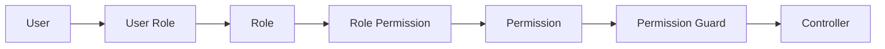

# RBAC Architecture

RBAC remains database-driven. Users receive roles, roles receive permissions, and controllers enforce access through guards and decorators.

## Seeded Roles

- `CUSTOMER`
- `TRAVEL_AGENT`
- `ADMIN`

Milestone 8 adds dynamic role management APIs:

```text
POST /api/v1/roles
PATCH /api/v1/roles/:code
PUT /api/v1/roles/:code/permissions
POST /api/v1/roles/:code/permissions
POST /api/v1/roles/:code/permissions/remove
```

These routes require `roles.manage`. Existing read routes require `roles.view`.

## Flow



Permissions remain the primary authorization unit. Future approval workflows should record role and permission mutations in `audit_logs` before production rollout.
