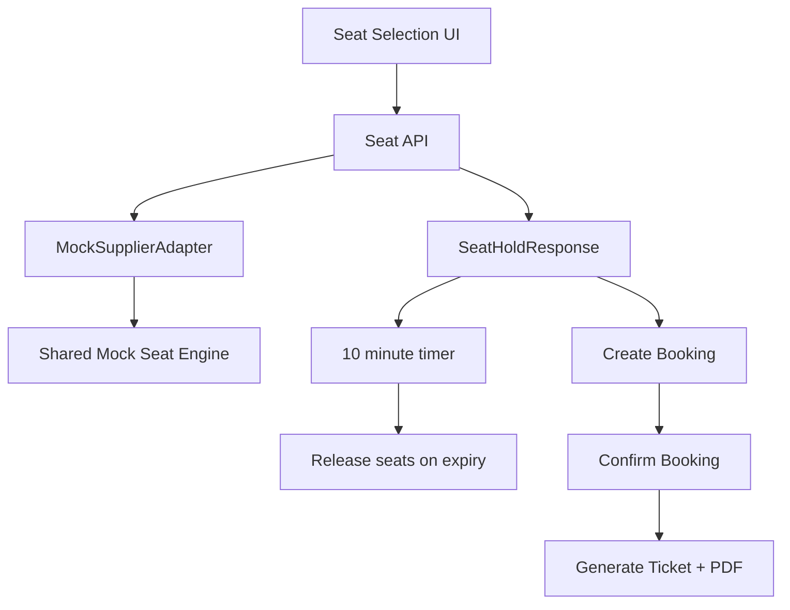

# Seat Engine Documentation

Milestone 5 seat inventory is generated by `packages/shared/src/booking/mock-booking-engine.ts` and exposed through `MockSupplierAdapter`.

Supported layout families:

- `2+2 Seater`
- `2+1 Sleeper`
- `Semi Sleeper`
- `Volvo`
- `Mercedes`
- `Single Axle`
- `Double Axle`
- `Lower Deck`
- `Upper Deck`

Seat status model:

- `AVAILABLE`
- `BOOKED`
- `LADIES`
- `RESERVED`
- `BLOCKED`
- `SELECTED` is frontend-only UI state.

Seat attributes:

- Seat number
- Seat type
- Deck
- Row and column
- Fare
- Window flag
- Extra legroom flag
- Emergency exit flag
- Gender restriction

Reservation architecture:

Future supplier integration strategy:

- Keep web pages bound to `@vnbus/types` contracts only.
- Replace `MockSupplierAdapter` methods with real supplier implementations.
- Preserve normalized seat statuses and layout contracts.
- Keep supplier PNR, supplier booking ID, and ticket references separate from internal booking IDs.
- Keep live tracking behind `trackBus()` and ticket download behind `downloadTicket()`.
