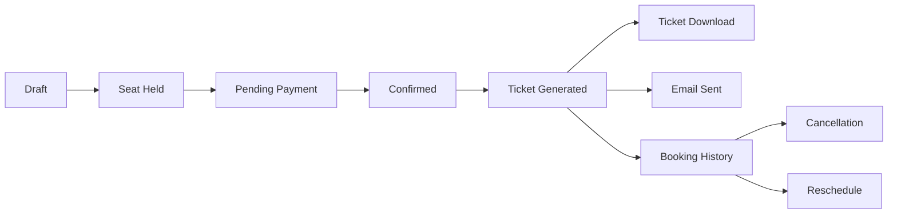

# Ticket Architecture

Milestone 6 makes tickets an internal Vriddhi Nexus model, not a supplier response passthrough.

## Folder Structure

```text
apps/api/src/modules/ticket/
  controllers/ticket.controller.ts
  dto/ticket-summary.dto.ts
  dto/ticket-workflow.dto.ts
  entities/ticket.entity.ts
  interfaces/ticket.interface.ts
  mappers/ticket.mapper.ts
  repositories/ticket.repository.ts
  services/ticket.service.ts
  tests/ticket.service.spec.ts
  validators/ticket.validator.ts

apps/api/src/modules/timeline/
apps/api/src/modules/booking-history/
apps/api/src/shared/email/
apps/web/components/booking-flow.tsx
apps/web/components/booking-management.tsx
```

## Lifecycle



## Ticket Model

`TicketRecord` contains ticket ID, booking ID/reference, mock PNR, journey date, operator, bus type, mock bus number, route, departure/arrival time, duration, passengers, seat numbers, boarding/dropping points, fare breakdown, booking date/status, QR code, terms, emergency contact, support contact, issued timestamp, download timestamp, and email timestamp.

## PDF And QR

The mock PDF is returned as a base64 `application/pdf` JSON envelope. It is intentionally generated internally and does not use S3 or a PDF provider. QR output contains booking ID, PNR, journey date, passenger count, and a mock verification URL.

## Supplier Mapping

Future suppliers should map their PNR, ticket number, bus details, passenger details, boarding/dropping points, fare, and policy fields into `TicketRecord`. Supplier-specific fields should remain inside adapter mappers or metadata, not controller responses.
